# 🏛️ Arsitektur Sistem dan SDLC
## Journey Learn LMS - Learning Management System

---

## 📐 BAGIAN 1: ARSITEKTUR SISTEM

### 1.1 Arsitektur Layer Sistem

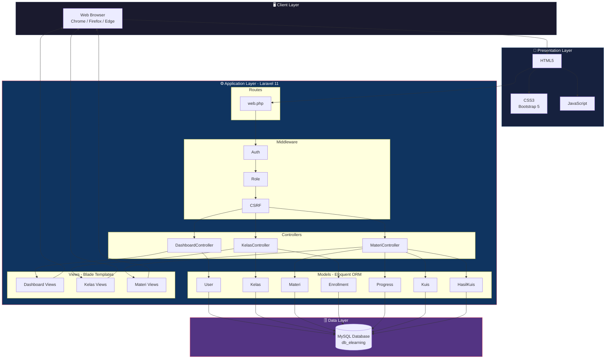

---

### 1.2 MVC Pattern Flow

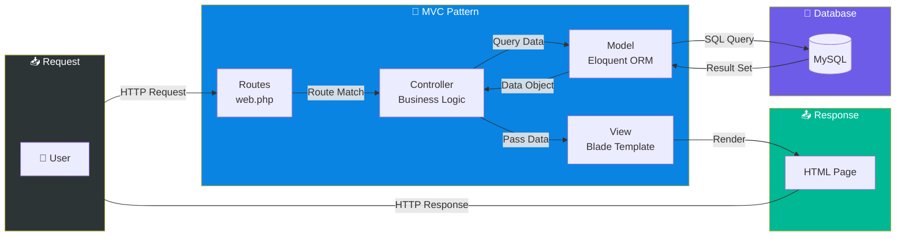

---

### 1.3 Database ERD (Entity Relationship Diagram)

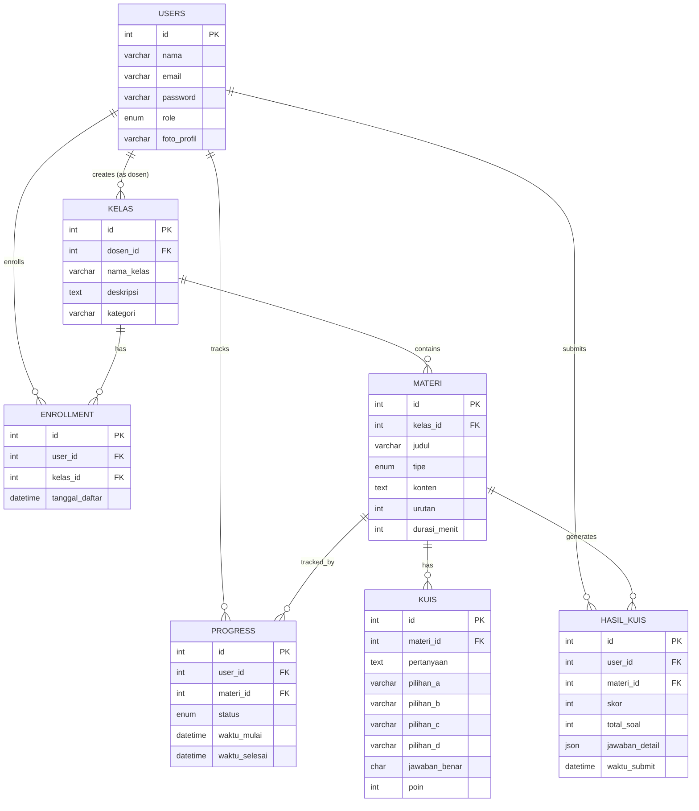

---

### 1.4 Komponen Teknologi

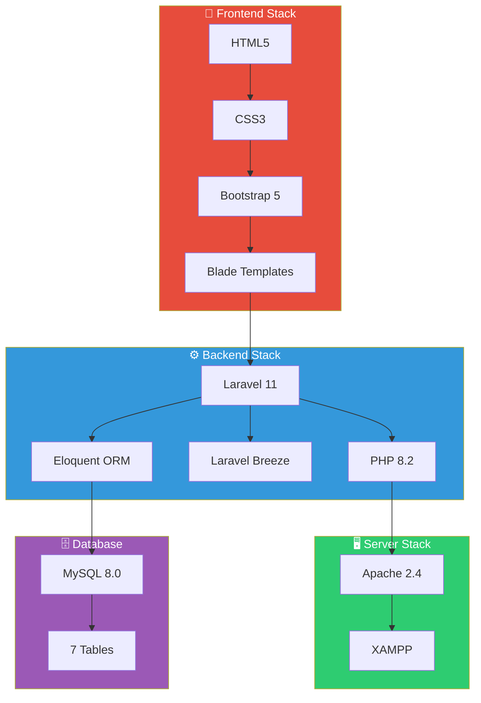

---

## 🔄 BAGIAN 2: SDLC (Software Development Life Cycle)

### 2.1 Model SDLC: Waterfall + Iterative

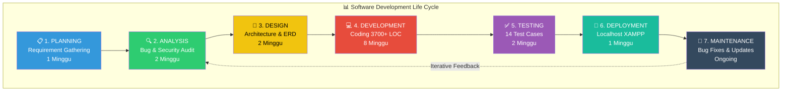

---

### 2.2 Detail Fase SDLC

#### 📌 Fase 1: PLANNING

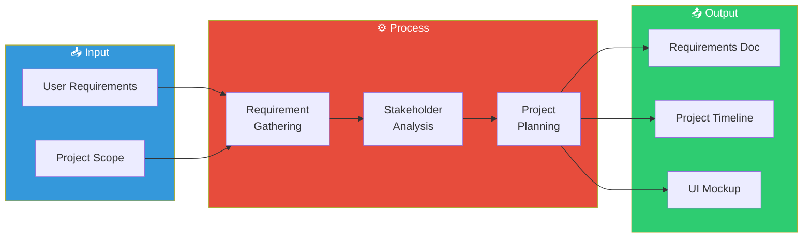

**Deliverables:**
- ✅ Feature list (Login, Dashboard, Browse Kelas, Sequential Learning, Quiz)
- ✅ User stories (Dosen & Mahasiswa)
- ✅ Timeline 4 bulan

---

#### 📌 Fase 2: ANALYSIS

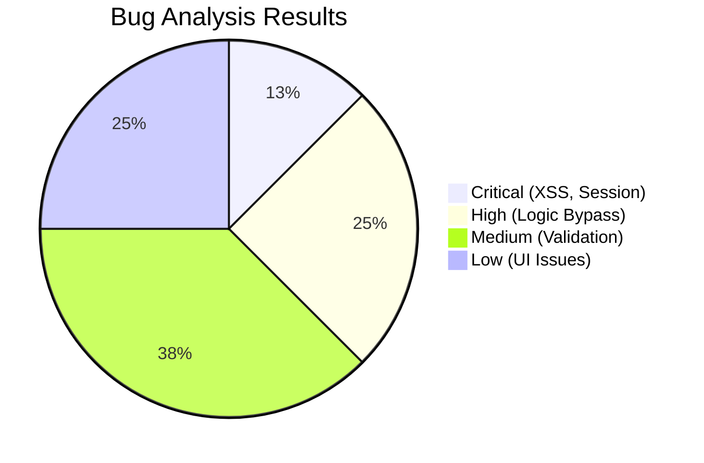

**Temuan Kritis:**
| Severity | Issue | Solution |
|----------|-------|----------|
| CRITICAL | XSS Vulnerability | Blade escaping |
| CRITICAL | Session Fixation | session_regenerate_id() |
| HIGH | Sequential Learning Bypass | Fixed logic |
| HIGH | Unlimited Quiz Attempts | Added 3x limit |
| MEDIUM | Missing CSRF | Laravel built-in |

---

#### 📌 Fase 3: DESIGN

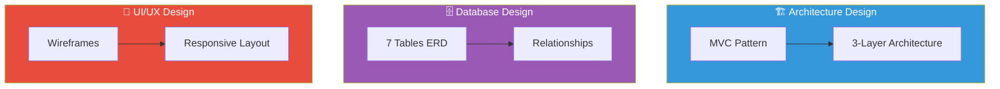

---

#### 📌 Fase 4: DEVELOPMENT

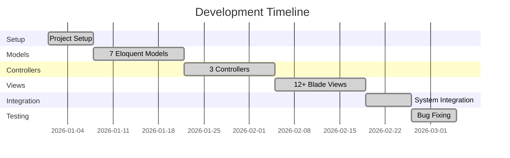

**Code Statistics:**
```
Files Created: 25+
├── Models: 7 files (~800 LOC)
├── Controllers: 3 files (~1200 LOC)
├── Views: 12+ files (~1500 LOC)
├── Routes: 1 file (~150 LOC)
└── Middleware: 1 file (~30 LOC)

Total: ~3700+ Lines of Code
```

---

#### 📌 Fase 5: TESTING

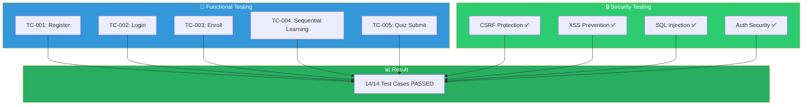

---

#### 📌 Fase 6: DEPLOYMENT

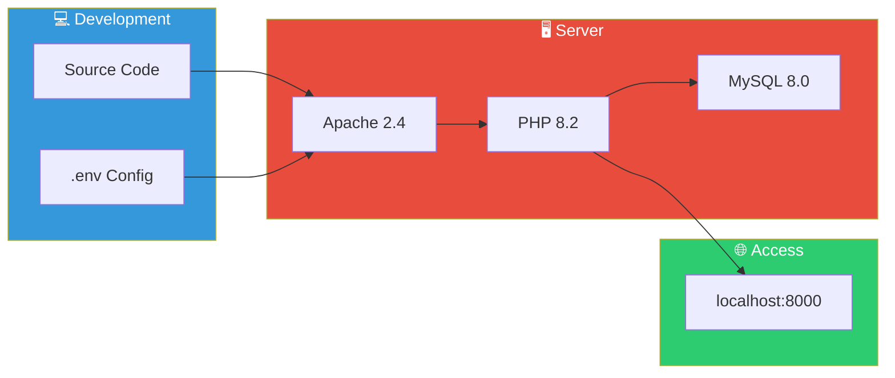

**Deployment Commands:**
```bash
cd c:\xampp\htdocs\LMS-Laravel
php artisan serve
# Access: http://127.0.0.1:8000
```

---

#### 📌 Fase 7: MAINTENANCE

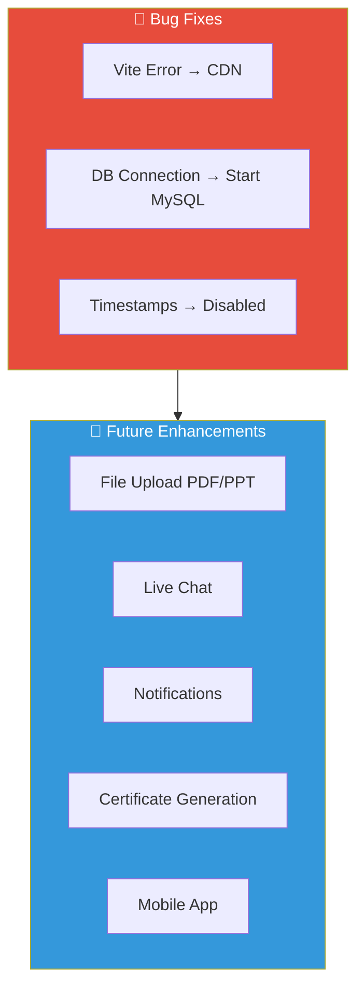

---

## 📊 User Flow Diagram

### Mahasiswa Flow

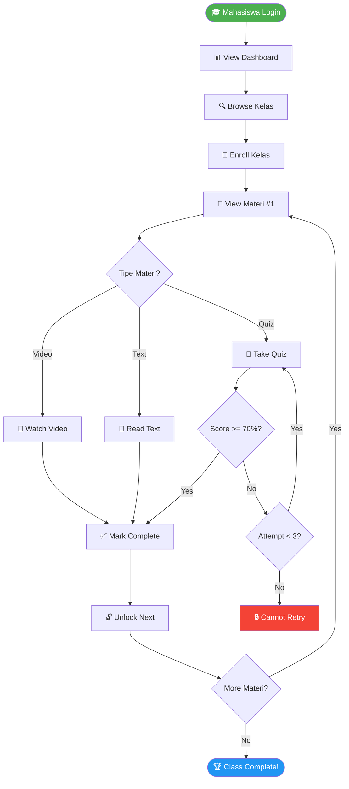

### Dosen Flow

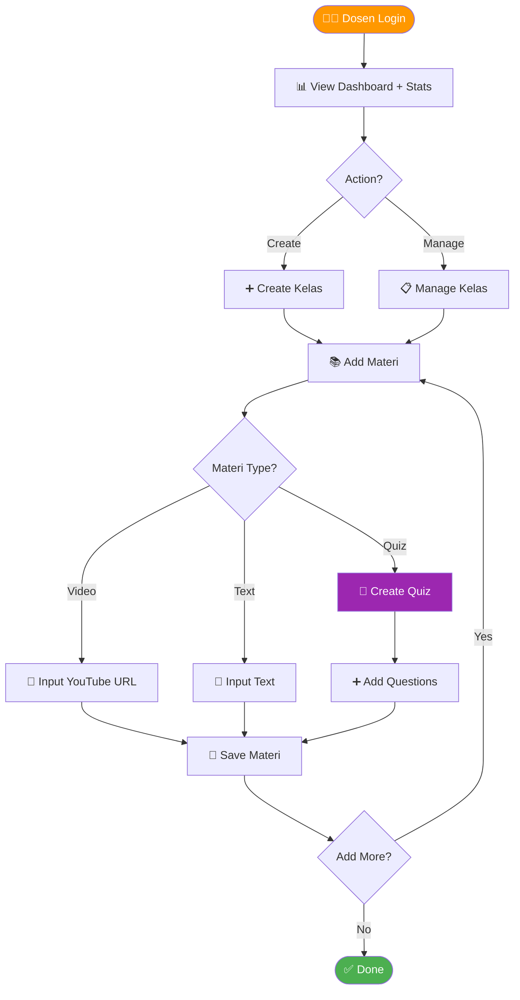

---

## ✅ Kesimpulan

| Aspek | Detail |
|-------|--------|
| **Arsitektur** | MVC Pattern, 3-Layer, Laravel 11 |
| **Database** | MySQL, 7 tabel, ERD terstruktur |
| **SDLC** | Waterfall + Iterative, 7 fase |
| **Development** | 4 bulan, 3700+ LOC |
| **Testing** | 14 test cases, security audit |
| **Security** | CSRF, XSS, SQL Injection protected |

---

*Dokumen ini dibuat untuk keperluan presentasi dan dokumentasi proyek*  
*Journey Learn LMS © 2026*
