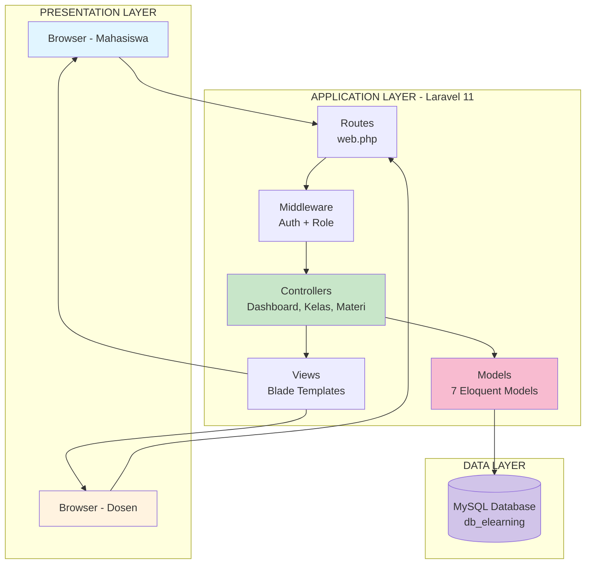
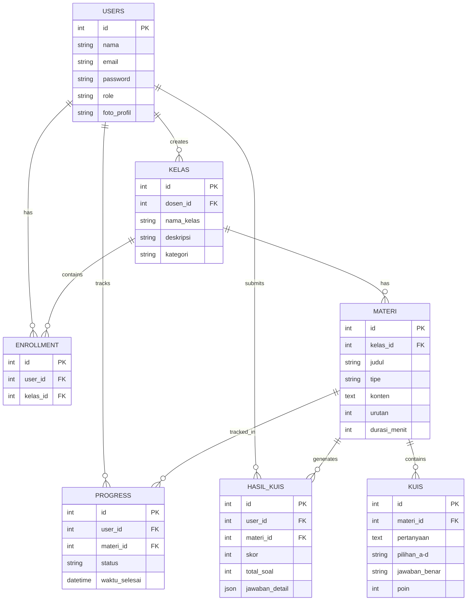
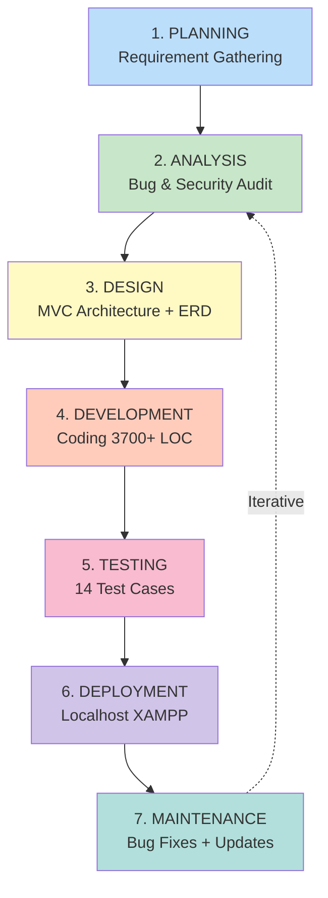
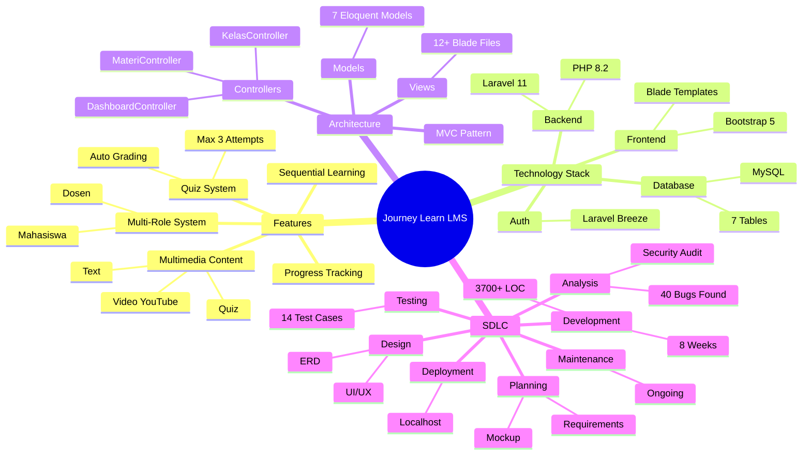
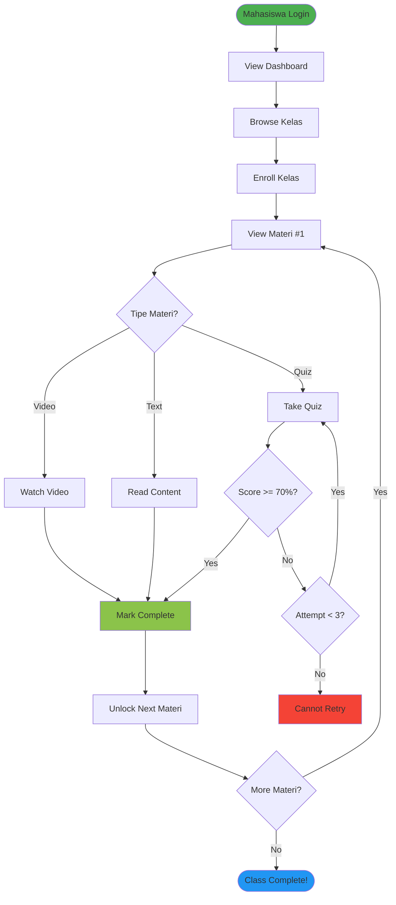
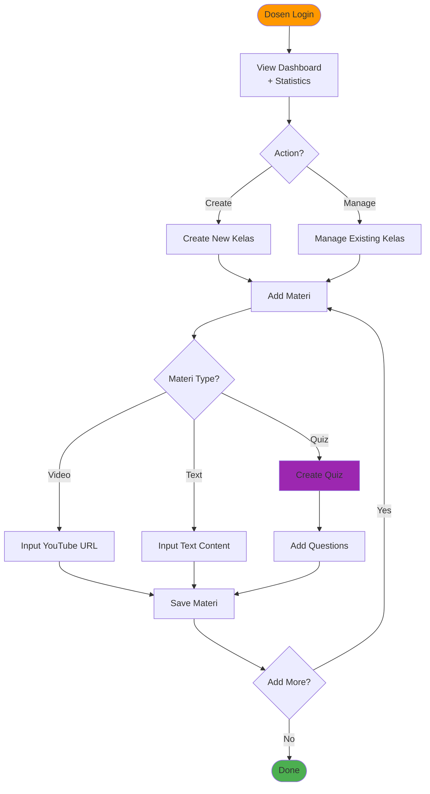

# 🎨 Diagram Visual untuk Presentasi
## Journey Learn LMS - Visual Diagrams

---

## 📌 CARA MENGGUNAKAN DIAGRAM INI

### Opsi 1: Mermaid Live Editor (Recommended)
1. Buka: https://mermaid.live/
2. Copy kode Mermaid dari file ini
3. Paste di editor
4. Download sebagai PNG/SVG

### Opsi 2: Draw.io / diagrams.net
1. Buka: https://app.diagrams.net/
2. Buat diagram manual berdasarkan structure di bawah
3. Export sebagai PNG/PDF

### Opsi 3: Canva / PowerPoint
1. Gunakan template mind map
2. Isi dengan data dari dokumen ini

---

## 🏗️ DIAGRAM 1: ARSITEKTUR MVC SISTEM

**Cara Render:**
Copy kode di atas → Paste ke https://mermaid.live/ → Download PNG

---

## 🗄️ DIAGRAM 2: DATABASE ERD (Entity Relationship)

**Cara Render:**
Copy kode di atas → Paste ke https://mermaid.live/ → Download PNG

---

## 🔄 DIAGRAM 3: SDLC WATERFALL FLOW

**Cara Render:**
Copy kode di atas → Paste ke https://mermaid.live/ → Download PNG

---

## 🧠 DIAGRAM 4: PROJECT MIND MAP

**Cara Render:**
Copy kode di atas → Paste ke https://mermaid.live/ → Download PNG

---

## 🎯 DIAGRAM 5: FLOW DIAGRAM USER JOURNEY

### A. Mahasiswa Flow

### B. Dosen Flow

---

## 📊 ALTERNATIF: Tools untuk Membuat Diagram

### 1. **Mermaid Live Editor** (Recommended)
- URL: https://mermaid.live/
- Gratis, langsung render
- Export PNG/SVG/PDF

### 2. **Draw.io / diagrams.net**
- URL: https://app.diagrams.net/
- Drag & drop interface
- Banyak template

### 3. **Lucidchart**
- URL: https://www.lucidchart.com/
- Professional templates
- Free tier available

### 4. **Canva**
- URL: https://www.canva.com/
- Mind map templates
- Easy to customize

### 5. **PowerPoint / Google Slides**
- Built-in SmartArt
- Custom shapes
- Export sebagai gambar

---

## 💡 Tips Presentasi dengan Diagram

1. **Gunakan warna konsisten** untuk setiap layer/komponen
2. **Tambahkan legenda** jika diagram kompleks
3. **Export dalam resolusi tinggi** (untuk proyektor)
4. **Buat animasi** di PowerPoint untuk flow diagram
5. **Print dalam A3** untuk poster presentasi

---

## 📥 Quick Links

| Diagram | Mermaid Code Location | Type |
|---------|----------------------|------|
| MVC Architecture | Section 1 | Graph TB |
| Database ERD | Section 2 | ER Diagram |
| SDLC Flow | Section 3 | Graph TD |
| Mind Map | Section 4 | Mindmap |
| User Journey | Section 5 | Flowchart |

---

*Semua diagram dalam file ini bisa di-copy dan di-render di https://mermaid.live/*
*Untuk hasil terbaik, export sebagai SVG (vector) agar tidak pecah saat diperbesar*
